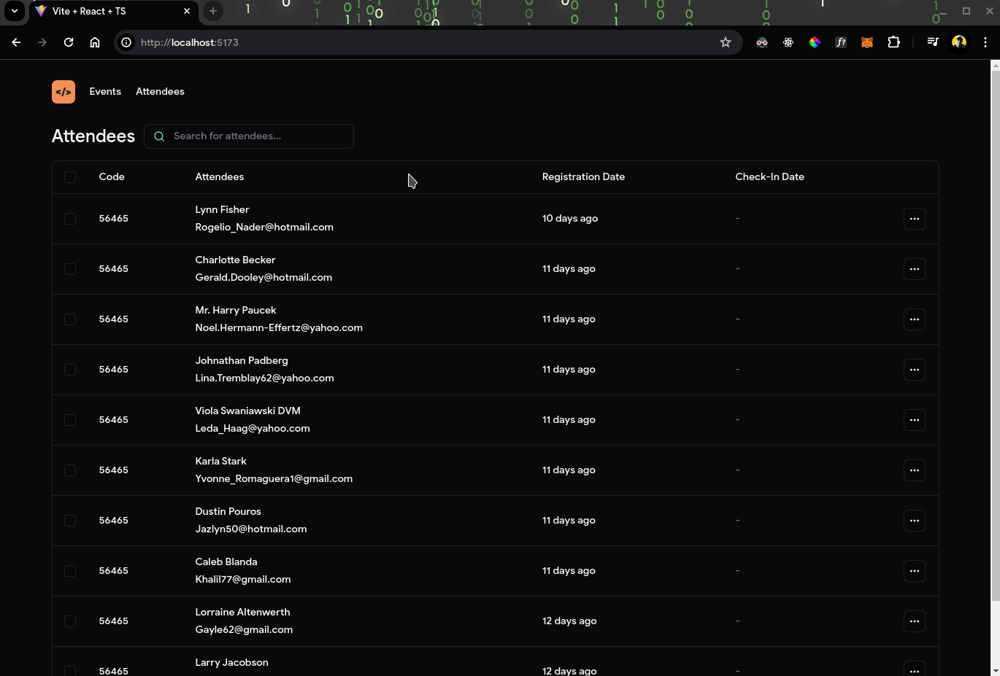

<h1 align="center">PassIn (Event Manager) - ReactJS</h1>

## About this Project

This is an Front-end web project, build with ReactJS, which simulates an event manager. In this application, the admin will be able to register events, and participants will be able to register, if there is space, and will be able to view their badge, with information about their registration and the event

## Project presentation

## Functionalities

- Events

  [] Create an event with Title, Details, Slug and Maximum Attendees.
  [] List an event information by ID.
  [X] List all event's participants.

- Attendees
  [] Create and Register an attendee for an event.
  [] List an attendee's badge information.
  [] Create the attendee check-in.

## Used Techs

- Vite: A modern, fast, and lightweight build tool and development server for front-end web projects.
- Lucide: Icon library designed to provide a flexible and customizable set of icons for web applications.
- Faker JS: A popular JavaScript library used for generating fake data for testing and development purposes
- Dayjs: A lightweight JavaScript library designed for parsing, validating, manipulating, and formatting dates and times.

# Author

Made with 💚 by Guilherme Bafica 👋

